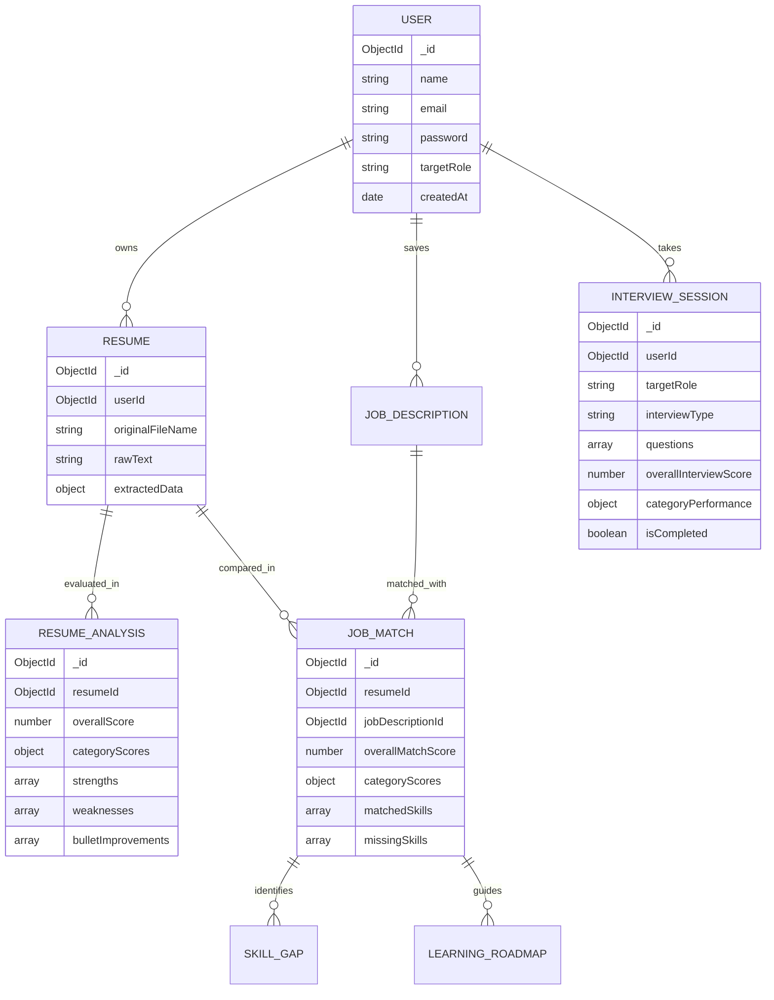

# AI-Powered Career Coach

> **Autonomous Career Engineering Suite**  
> *Resume Analyzer • Job Matcher • Skill Gap Analyzer • AI Interview Coach*

---

## Overview

**AI-Powered Career Coach** is a modern full-stack web application engineered to empower engineering students and technical job seekers. The platform parses PDF resumes, calculates an objective **Resume Quality Score (0–100)**, matches credentials against complex job descriptions using a transparent weighted scoring algorithm, pinpoints prioritized skill gaps with week-by-week learning roadmaps, and conducts interactive, multi-mode AI mock interviews with instantaneous rubric grading.

---

## Problem Statement

Technical job seekers face three major hurdles:
1. **The "Black Box" ATS**: Resumes are screened out by keyword mismatch and vague formatting issues without actionable feedback.
2. **Ambiguous Skill Gaps**: Job descriptions list dozens of requirements, leaving candidates uncertain about which skills are urgent versus preferred.
3. **High-Stress Technical Interviews**: Traditional mock interviews are expensive or generic, failing to assess domain-specific depth (e.g. Verilog, CDC, and FSMs for RTL engineers; RTOS and ISRs for Embedded developers).

---

## Solution

AI-Powered Career Coach addresses these hurdles through a unified, production-style platform:
- **Heuristic & AI PDF Extraction**: Directly parses candidate PDF resumes and structures education, experience, projects, metrics, and technical skills.
- **Resume Quality Audit**: Assesses action verb impact, quantitative metrics, and formatting health without fabricating credentials.
- **Weighted Compatibility Engine**: Calculates ATS match estimates across Technical Skills (40%), Keywords (20%), Experience (15%), Projects (15%), and Education (10%).
- **Prioritized Skill Gap Roadmaps**: Categorizes missing skills (High, Medium, Low priority) and formulates a 4-week structured milestone curriculum.
- **Multi-Mode AI Mock Interview Coach**: Simulates Technical, HR, and Project Defense rounds with 4-criterion rubric scoring (Technical Accuracy, Relevance, Completeness, Communication) and exemplary model answers.

---

## Architecture Diagram

```
+-----------------------------------+       +-----------------------------------+
|      React 18 + Vite Web App      |       |    React Native + Expo Mobile     |
|  (Tailwind CSS, Recharts, Lucide) |       |  (iOS & Android, Expo SDK 57)     |
+-----------------+-----------------+       +-----------------+-----------------+
                  |                                           |
                  |           REST API / Bearer JWT           |
                  +─────────────────────┬─────────────────────+
                                        v
                        +-------------------------------+
                        | Node.js + Express REST Server |
                        | (Helmet, CORS, Rate Limit)    |
                        +---------------+---------------+
                                        |
                 +──────────────────────┴──────────────────────+
                 v                                             v
+-------------------------------+             +---------------------------------+
|            MongoDB            |             |      Google Gemini AI API       |
| (Users, Resumes, Analyses,    |             |  (Structured Prompts, Rubrics,  |
|  Jobs, Roadmaps, Interviews)  |             |   Strict Scoring, Fallbacks)    |
+-------------------------------+             +---------------------------------+
```

### Resume & Matching Workflow
```
Resume PDF ──> PDF Parser ──> Extracted Text ──> AI Analysis ──> Quality Score Breakdown
                                                                       │
                                                                       v
Job Description Text ──> Requirements Extractor ─────────────> Weighted Match Engine (0-100)
                                                                       │
                                                  ┌────────────────────┴────────────────────┐
                                                  v                                         v
                                         Skill Gap Priorities                    4-Week Learning Roadmap
```

### AI Interview Practice Workflow
```
Target Role / Resume / JD ──> Question Generator ──> Live Interactive Question
                                                              │
                                                              v
Candidate Response (Text / Speech) ──> AI Rubric Evaluator ──> Instant Feedback (1-10) + Model Answer
                                                              │
                                                              v
                                                   Final Scorecard (0-100)
```

---

## Features

### 1. User Authentication & Profile
- Secure JWT-based authentication with bcrypt password hashing.
- Role personalization: Select from **RTL Design Engineer**, **FPGA Design Engineer**, **VLSI Engineer**, **Physical Design Engineer**, **Embedded Systems Engineer**, **Software Engineer**, **Data/AI Engineer**, or **Other**.
- Real-time role switching affecting interview questions, roadmaps, and matching weights.

### 2. Resume Upload & PDF Parsing
- Drag-and-drop PDF dropzone supporting files up to 10MB.
- Heuristic and regex section parser for contact information, skills, experience, projects, education, and achievements.
- Scanned/image-only PDF detection displaying helpful warnings rather than silent errors.

### 3. AI Resume Quality Score
- Overall score (0–100) broken down across 8 categories: Skills, Projects, Experience, Education, Keywords, Achievements, Structure, Relevance.
- Action verb analysis highlighting strong active verbs versus passive phrases.
- Quantifiable metric counter tracking percentage gains, frequencies, and benchmarks.
- Transformative bullet point optimizer with "Original vs Suggested" rewrites and rationale.

### 4. Job Description Compatibility Matcher
- Paste any job posting to extract required skills, preferred qualifications, and responsibilities.
- Transparent weighted compatibility calculation:
  - Technical Skills = 40%
  - Keywords = 20%
  - Experience = 15%
  - Projects = 15%
  - Education = 10%
- Color-coded badges for verified matched skills and high-priority missing skills.
- Multi-job dashboard to track and compare match scores across multiple employers.

### 5. Skill Gap Analysis & Explanations
- Categorizes gaps by urgency: **High**, **Medium**, and **Low** priority.
- Recommended proficiency targets: **Beginner**, **Intermediate**, or **Advanced**.
- Deep educational explanations detailing why each skill matters for your target role.
- Concrete syllabus of learning topics to study.

### 6. Personalized 4-Week Learning Roadmap
- Milestone-based curriculum detailing weekly focuses, prerequisites, topics, and hands-on practice.
- Estimated weekly study hours and difficulty indicators.

### 7. Interactive AI Mock Interview Coach
- **Four Interview Modes**:
  - **Technical Round**: Role-specific questions (e.g. Verilog, CDC, FSM, STA for RTL; C, RTOS, GPIO, UART, SPI for Embedded; DSA & System Design for Software).
  - **HR & Behavioral**: STAR-method evaluation for conflict resolution, leadership, and cultural fit.
  - **Project Defense**: Architecture breakdowns, debugging war stories, and testing methodologies.
  - **Mixed Loop**: Balanced comprehensive simulation.
- **Selectable Session Lengths**: 5, 10, or 15 questions.
- **Question Sources**: Role knowledge base, candidate's actual resume bullet points, or pasted job description.
- **Interactive Rubric Grading (0–10)**:
  - Technical Accuracy
  - Relevance
  - Completeness
  - Communication
- Collapsible exemplary model answer demonstrations.
- Final scorecard with strengths, revision areas, and performance charts.

---

## Tech Stack

### Frontend
- **Framework**: React 18
- **Build Tool**: Vite
- **Styling**: Tailwind CSS (Dark-first modern glassmorphism design system)
- **Routing**: React Router v6 (Protected route wrappers)
- **HTTP Client**: Axios with automated bearer token injection
- **Icons**: Lucide React
- **Data Visualization**: Recharts (Line trends, metric gauges)
- **Micro-Interactions**: Canvas Confetti

### Backend
- **Runtime**: Node.js (ES Modules)
- **Framework**: Express.js
- **Database**: MongoDB with Mongoose (compatible with MongoDB Atlas and zero-config local memory server)
- **Security**: Helmet, CORS, Express Rate Limit, bcryptjs, JSONWebToken
- **File Ingestion**: Multer (10MB limit, PDF MIME filtering)
- **Document Extraction**: `pdf-parse`
- **AI Integration**: Google Gemini API (`@google/generative-ai`) with resilient fallback heuristics

---

## Environment Variables

### Backend (`backend/.env`)

| Variable | Description | Example / Default |
| :--- | :--- | :--- |
| `PORT` | Backend listening port | `5000` |
| `CLIENT_URL` | Frontend origin for CORS | `http://localhost:5173` |
| `MONGODB_URI` | MongoDB Atlas connection string (Leave blank for in-memory DB) | `mongodb+srv://...` |
| `JWT_SECRET` | Secret key for JWT signing | `your_secure_jwt_secret_key` |
| `GEMINI_API_KEY` | Google Gemini API Key | `AIzaSy...` |
| `NODE_ENV` | Environment mode | `development` |

> [!NOTE]
> If `MONGODB_URI` is not provided, the backend automatically starts an in-memory MongoDB instance for seamless local testing without any database installation needed.
> If `GEMINI_API_KEY` is not configured, the backend automatically uses its intelligent domain heuristics engine so the application remains 100% operational.

---

## Installation & Running Locally

### Prerequisites
- Node.js v18+ (tested with Node v24)
- npm v9+

### 1. Clone the Repository
```bash
git clone https://github.com/your-username/ai-career-coach.git
cd ai-career-coach
```

### 2. Setup and Run Backend
```bash
cd backend
npm install
cp .env.example .env
# Optional: Add your GEMINI_API_KEY or MONGODB_URI in backend/.env
npm start
```
*Backend runs on `http://localhost:5000`.*

### 3. Setup and Run Frontend
In a separate terminal window:
```bash
cd frontend
npm install
npm run dev
```
*Frontend runs on `http://localhost:5173`.*

---

## API Documentation

### Authentication (`/api/auth`)
- `POST /api/auth/register` — Create a new account with target career role.
- `POST /api/auth/login` — Sign in and receive JWT token.
- `GET /api/auth/me` — Retrieve authenticated user profile.
- `PUT /api/auth/role` — Update target engineering role.

### Resume Management (`/api/resume`)
- `POST /api/resume/upload` — Upload PDF file (multipart/form-data) and extract text.
- `GET /api/resume` — List candidate's uploaded resumes.
- `GET /api/resume/:id` — Retrieve resume details.
- `DELETE /api/resume/:id` — Delete resume and associated analyses.

### Resume Analysis (`/api/analysis`)
- `POST /api/analysis` — Compute Resume Quality Score (0–100) and category breakdowns.
- `GET /api/analysis/latest` — Retrieve most recent resume analysis.

### Job Descriptions (`/api/jobs`)
- `POST /api/jobs` — Save and parse job description requirements.
- `GET /api/jobs` — List saved job descriptions.
- `DELETE /api/jobs/:id` — Remove saved job.

### Job Matching (`/api/matches`)
- `POST /api/matches` — Compute weighted compatibility score against active resume.
- `GET /api/matches` — List multi-job match comparisons.
- `GET /api/matches/:id` — View specific match breakdown.

### Skill Gaps & Roadmap (`/api/skills`, `/api/roadmap`)
- `GET /api/skills/latest` — Retrieve prioritized missing skills and explanations.
- `POST /api/roadmap/generate` — Formulate 4-week milestone curriculum.
- `GET /api/roadmap/latest` — Retrieve active learning roadmap.

### AI Mock Interview (`/api/interview`)
- `POST /api/interview/start` — Initialize mock interview session with tailored questions.
- `POST /api/interview/:id/answer` — Submit answer for real-time rubric grading (1–10).
- `POST /api/interview/:id/complete` — Finalize session and compute overall scorecard.
- `GET /api/interview/history` — List completed interview attempts.
- `GET /api/interview/:id` — Retrieve question-by-question diagnostic review.

### Dashboard (`/api/dashboard`)
- `GET /api/dashboard/summary` — Aggregate KPI scores, recent matches, and trend series.

---

## Database Design



---

## Security Best Practices
- **Never Client-Side AI**: Gemini API keys and prompts are strictly maintained on the backend.
- **Authentication**: Stateless Bearer JWT tokens with 7-day expiration and bcrypt salt hashing.
- **Upload Hardening**: File MIME validation (application/pdf only) and strict 10MB memory streaming.
- **Rate Limiting**: IP-based rate limiting on sensitive auth and AI generation endpoints.
- **Security Headers**: Helmet integration setting HTTP security headers.
- **Ownership Verification**: All protected endpoints enforce strict ownership checks before query execution.

---

## Testing & Quality Assurance

Run the automated integration test suite:
```bash
cd backend
npm test
```
The test suite validates:
- [x] Health check response
- [x] User registration & duplicate email handling
- [x] Profile retrieval & role customization
- [x] Job description extraction & skill parsing
- [x] Mock interview question generation & multi-round answering
- [x] Rubric grading calculations (1–10)
- [x] Learning roadmap generation
- [x] Dashboard aggregated analytics

---

## Deployment Guide

### Deploying Frontend (Vercel)
1. Push your repository to GitHub.
2. In Vercel, click **Add New Project** and select `frontend` as the root directory.
3. Framework Preset: **Vite**.
4. Configure environment variable:
   - `VITE_API_URL`: Your deployed backend URL (e.g. `https://your-api.onrender.com`).
5. Click **Deploy**.

### Deploying Backend (Render / Railway)
1. Create a **Web Service** pointing to the `backend` directory.
2. Build Command: `npm install`.
3. Start Command: `npm start`.
4. Add Environment Variables:
   - `MONGODB_URI`: Your MongoDB Atlas connection string.
   - `JWT_SECRET`: A cryptographically secure random string.
   - `GEMINI_API_KEY`: Your Google Gemini API key.
   - `CLIENT_URL`: Your Vercel frontend URL (e.g. `https://your-app.vercel.app`).
5. Click **Deploy**.

---

## Important ATS Disclaimer
*The compatibility, quality, and match scores generated by this platform are AI-based analytical estimates intended to help users optimize resumes and interview preparedness. Actual corporate Applicant Tracking Systems (ATS) and hiring teams employ varying proprietary algorithms and human evaluations.*

---

## License
This project is open-source under the MIT License.
